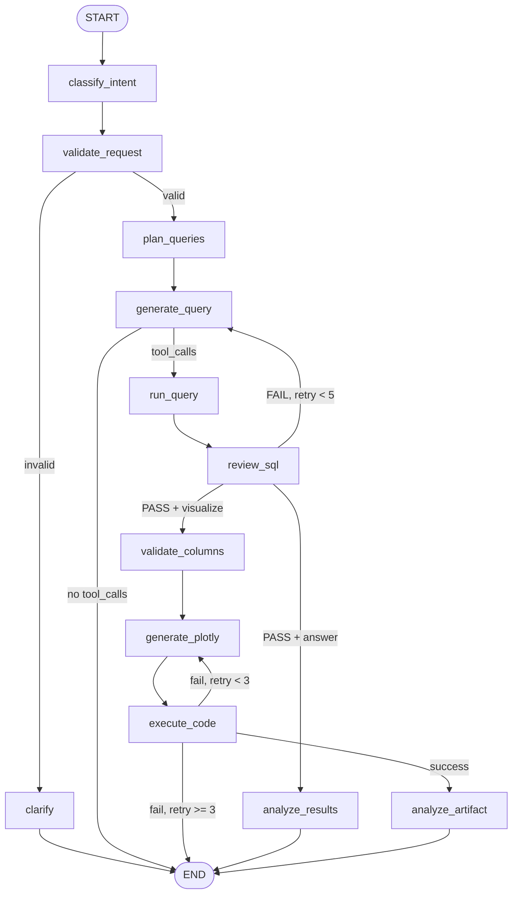

# City Growth AI Agent

An AI-powered conversational agent for urban economics analysis. Ask natural-language questions about employment, wages, and establishments across ~400 U.S. metropolitan areas and get answers, interactive charts, or multi-chart comparisons — all backed by Bureau of Labor Statistics QCEW data.

Built with LangGraph, FastAPI, React, and PostgreSQL.

## Why This Exists

Urban economists, planners, and economic developers regularly need to explore MSA-level labor market data — wage trends, employment shifts, city comparisons, growth rates. The typical workflow involves writing SQL, exporting to Excel, and manually building charts. This agent replaces that with a conversational interface:

```
You: Compare employment CAGR between Austin, Miami, and Seattle from 2014 to 2024
Agent: [calls data_analysis_workflow → SQL → Plotly chart]
       Austin-Round Rock-Georgetown, TX: 4.2% CAGR
       Miami-Fort Lauderdale-Pompano Beach, FL: 2.1% CAGR
       Seattle-Tacoma-Bellevue, WA: 3.0% CAGR
       [interactive bar chart embedded in chat]
```

## Architecture

The system has three layers, each usable independently:

```
                    React Frontend (port 5173)
                           |
                    FastAPI API (port 8001)
                           |
                 Conversational ReAct Agent
                    (LangGraph prebuilt)
                           |
              +------------+-------------+
              |            |             |
        Visualization   Schema       Direct SQL
         Workflow        Tools        Explorer
       (12-node graph)
              |
    +---------+---------+
    |         |         |
  Intent   SQL Gen    Plotly Code
  Classify  + Review   + Execution
```

### Layer 1: Visualization Workflow

A deterministic 12-node LangGraph `StateGraph` that handles the heavy lifting:

1. **Intent Classification** — LLM-driven (not keyword matching) detection of `answer`, `visualize`, or `multi_chart` intent
2. **Request Validation** — Rejects impossible queries (GDP, population) before wasting compute
3. **Query Planning** — Structured output that plans the SQL strategy *before* generation
4. **SQL Generation + Review** — Generates SQL, then a separate LLM call validates it matches user intent (up to 5 retries)
5. **Column Validation** — Anti-hallucination check: verifies generated code references columns that exist in the CSV
6. **Plotly Code Generation** — Structured output produces complete Python visualization code
7. **Sandboxed Execution** — Subprocess isolation with AST validation, blocked imports, and LLM-based error recovery (up to 3 retries)
8. **Analysis** — Generates key insights to accompany the chart

### Layer 2: Conversational Agent

A ReAct agent (`create_react_agent`) that wraps the workflow as one of 5 tools:

| Tool | Purpose |
|------|---------|
| `data_analysis_workflow` | Primary tool — runs the full viz workflow |
| `get_schema` | Returns table/column metadata |
| `sample_data` | Shows sample rows for data discovery |
| `list_cities` | Lists available MSAs (filterable by state) |
| `query_database` | Direct read-only SQL for exploration |

The agent decides which tools to call and can iterate — if a visualization fails, it can check the schema, verify city names, and retry.

### Layer 3: Web Application

- **Backend**: FastAPI with REST + WebSocket endpoints, SQLite for conversation persistence
- **Frontend**: React 19 + Vite 7 with Plotly.js for inline chart rendering
- **Persistence**: LangGraph thread state in PostgreSQL (via `PostgresSaver`), chat history in SQLite

## Data

**Source**: [Bureau of Labor Statistics QCEW](https://www.bls.gov/cew/) (Quarterly Census of Employment and Wages)

**Table**: `msa_wages_employment_data` (~9,200 rows)

| Column | Type | Description |
|--------|------|-------------|
| `area_fips` | text | FIPS code for geographic area |
| `year` | integer | 2001-2024 |
| `qtr` | text | `'A'` for annual, `'1'`-`'4'` for quarterly |
| `annual_avg_emplvl` | integer | Average employment level (jobs) |
| `avg_annual_pay` | integer | Average annual pay per worker |
| `annual_avg_wkly_wage` | integer | Average weekly wage |
| `total_annual_wages` | bigint | Total wages paid |
| `annual_avg_estabs_count` | integer | Number of establishments |
| `area_title` | text | Full MSA name (e.g., "Austin-Round Rock-Georgetown, TX") |
| `state` | text | 2-letter state code |

Coverage: ~400 MSAs across all 50 states, 24 years of annual data.

## Quick Start

### Prerequisites

- Python 3.12+
- [uv](https://docs.astral.sh/uv/) (Python package manager)
- PostgreSQL with the QCEW data loaded
- Node.js 18+ (for the frontend)
- A Gemini API key

### Setup

```bash
# Clone and install
git clone https://github.com/andresfortunato/City-Growth-AI-Agent.git
cd City-Growth-AI-Agent
uv sync

# Configure environment
cp .env.example .env
# Edit .env with your DB credentials and GEMINI_API_KEY

# Install frontend dependencies
cd frontend && npm install && cd ..
```

### Run: CLI Mode (quickest)

```bash
# Interactive conversation
uv run src/cli.py

# Single question
uv run src/cli.py "What is the average wage in Austin in 2023?"
```

### Run: Direct Visualization

```bash
# Generates a chart and saves to viz/
uv run src/visualization_agent.py "Show wage trends for Austin from 2010 to 2024"
```

### Run: Full Stack (API + Frontend)

```bash
# Terminal 1: Backend
bash scripts/start_server.sh    # http://localhost:8001

# Terminal 2: Frontend
cd frontend && npm run dev       # http://localhost:5173
```

Open http://localhost:5173 in your browser.

## Example Queries

**Text answers:**
```
What is the average wage in Austin in 2023?
How many MSAs are in California?
Which city has the highest average pay?
```

**Single charts:**
```
Create a line chart of wage trends for Austin from 2010 to 2024
Show a bar chart of top 10 MSAs by average annual pay in 2023
Visualize employment growth in Seattle since 2015
```

**Multi-city comparisons:**
```
Compare employment growth between Boston, Miami, and Seattle from 2014 to 2024
Show wage trends for Austin vs Dallas vs Houston from 2010 to 2024
```

**Calculations:**
```
Calculate CAGR of employment and wages for Dallas and Houston, 2014 to 2024
What's the employment growth rate in Austin between 2020 and 2024?
```

## Anti-Hallucination Design

The agent has multiple layers preventing incorrect outputs:

1. **Request Validation** — Rejects queries about unavailable metrics (GDP, population, housing) before running SQL
2. **Query Planning** — Structured plan prevents incomplete SQL (e.g., `SELECT MAX(year)` when user wants time series)
3. **SQL Review** — A separate LLM call validates the generated SQL matches user intent, with up to 5 retry attempts
4. **Column Validation** — Verifies that generated Plotly code references columns that actually exist in the CSV
5. **Code Sandbox** — AST validation blocks dangerous imports; subprocess isolation prevents side effects
6. **Structured Output** — All LLM outputs use Pydantic models, eliminating fragile string parsing

## Visualization Workflow



## Project Structure

```
City-Growth-AI-Agent/
├── src/                          # Core agent code
│   ├── cli.py                    # CLI entry point
│   ├── agent.py                  # ReAct conversational agent
│   ├── conversation.py           # Async chat interface
│   ├── db.py                     # Centralized DB connection pool
│   ├── visualization_agent.py    # 12-node LangGraph workflow
│   ├── visualization_nodes.py    # Intent, SQL review, Plotly, analysis nodes
│   ├── sql_tools.py              # SQL execution + CSV data handoff
│   ├── runner.py                 # Sandboxed code execution + error recovery
│   ├── validator.py              # AST-based code safety validation
│   ├── models.py                 # Pydantic structured output schemas
│   ├── state.py                  # LangGraph state definition
│   ├── prompts.py                # System prompts
│   ├── workspace.py              # Job workspace lifecycle
│   ├── checkpointer.py           # LangGraph persistence factories
│   ├── logger.py                 # JSONL run logging
│   └── tools/                    # Agent tool definitions
│       ├── workflow_tool.py      # Wraps visualization workflow
│       ├── schema_tools.py       # get_schema, sample_data, list_cities
│       └── query_tool.py         # Direct SQL exploration
├── api/                          # FastAPI backend
│   ├── app.py                    # App setup, CORS, health check
│   ├── chat.py                   # REST + WebSocket endpoints
│   ├── service.py                # Business logic, SQLite persistence
│   └── models.py                 # Request/response schemas
├── frontend/                     # React 19 + Vite 7
│   └── src/
│       ├── App.jsx               # Main layout (sidebar + chat)
│       ├── Chat.jsx              # Chat input + message list
│       ├── Sidebar.jsx           # Conversation history
│       ├── Message.jsx           # Message rendering + Plotly embeds
│       └── api.js                # HTTP + WebSocket client
├── ETL/                          # Data loading scripts (R)
├── database/                     # SQL maintenance + index scripts
├── evals/                        # Evaluation runner + 100+ test cases
├── tests/                        # Unit + integration tests
├── viz/                          # Saved chart artifacts
├── logs/                         # JSONL run logs
├── scripts/                      # Utilities
├── docs/                         # Design notes and plans
└── pyproject.toml
```

## Testing

```bash
# Run all non-integration tests (22 tests)
uv run pytest tests/ -m "not integration and not slow" -v

# Run pure unit tests only (no DB/LLM required)
uv run pytest tests/ -k "TestToolImports or TestAgentImports or test_validation" -v

# Run the full evaluation suite (requires DB + Gemini API key)
cd src && python ../evals/run_evaluation.py
```

The evaluation dataset contains 100+ test cases across 8 categories: text answers, single charts, multi-chart, multi-city, multi-state, edge cases, impossible queries, and nonexistent data.

## Tech Stack

| Component | Technology |
|-----------|-----------|
| Agent orchestration | LangGraph 0.2+ |
| LLM abstractions | LangChain 0.3+ |
| Default LLM | Google Gemini Flash |
| Backend API | FastAPI 0.115+ |
| Frontend | React 19, Vite 7, Plotly.js |
| Database | PostgreSQL (data) + SQLite (chat history) |
| Charting | Plotly (generated Python code, rendered as HTML + JSON) |
| Package management | uv |
| CI | GitHub Actions |

## Roadmap

### Near-Term
- [ ] WebSocket streaming for real-time token output
- [ ] Expand QCEW data to industry-level breakdowns (NAICS codes)
- [ ] Full test coverage with CI database service

### Medium-Term
- [ ] Additional datasets: housing costs, amenities, cost of living
- [ ] Specialized sub-agents:
  - Peer city selection expert
  - Growth trajectory analyst
  - Constraints analyst (infrastructure, labor supply)
- [ ] Guided city growth diagnostics workflow
- [ ] Report generation with embedded charts

### Long-Term
- [ ] Multi-tenant deployment with authentication
- [ ] Containerized deployment (Docker)
- [ ] Automated data pipeline (scheduled ETL)
- [ ] Model fine-tuning for domain-specific SQL generation

## API Reference

| Method | Endpoint | Description |
|--------|----------|-------------|
| `GET` | `/api/health` | Health check |
| `POST` | `/api/chat/message` | Send message, get response |
| `GET` | `/api/chat/conversations` | List conversations (paginated) |
| `GET` | `/api/chat/conversations/{id}` | Get conversation with messages |
| `DELETE` | `/api/chat/conversations/{id}` | Delete conversation |
| `PATCH` | `/api/chat/conversations/{id}` | Update conversation title |
| `WS` | `/api/chat/ws` | WebSocket for streaming (in progress) |

## Environment Variables

See `.env.example` for the full template. Required:

| Variable | Description |
|----------|-------------|
| `GEMINI_API_KEY` | Google Gemini API key |
| `DB_USER` | PostgreSQL username |
| `DB_PASSWORD` | PostgreSQL password |
| `DB_HOST` | PostgreSQL host (default: `localhost`) |
| `DB_PORT` | PostgreSQL port (default: `5432`) |
| `DB_NAME` | PostgreSQL database name (default: `postgres`) |

Optional:

| Variable | Description |
|----------|-------------|
| `MODEL_OVERRIDE` | Override default LLM (e.g., `google_genai:gemini-2.0-flash`) |
| `LANGSMITH_API_KEY` | LangSmith tracing key |
| `LANGSMITH_TRACING` | Enable/disable tracing (`true`/`false`) |
| `SKIP_COLUMN_VALIDATION` | Skip CSV column validation (`true`/`false`) |

## License

This project is for research and educational purposes.
