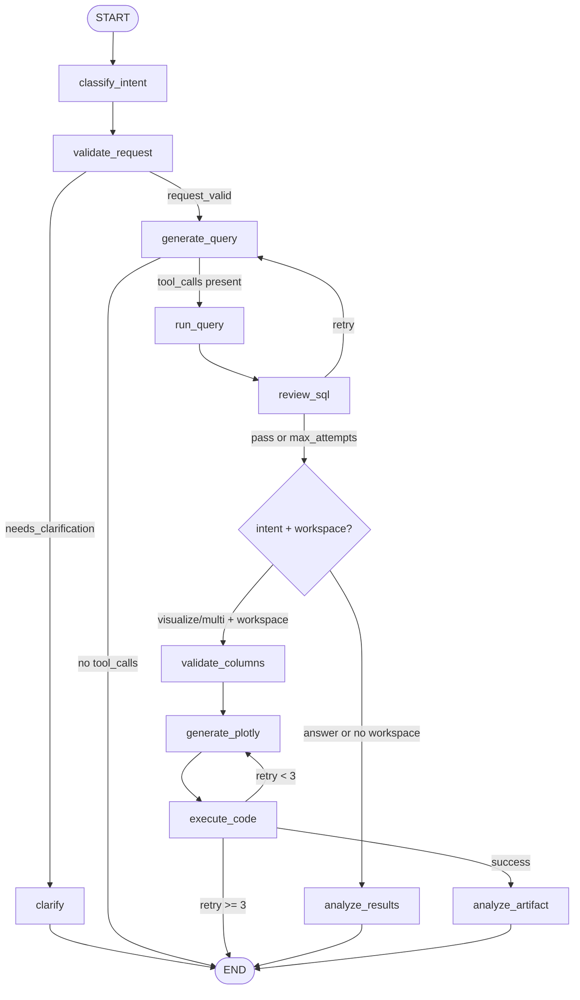

# City Growth AI Agent

LLM-driven SQL and visualization agent over urban economic data like QCEW MSA wage and employment data stored in Postgres (other data like industry-city level employment, housing costs, and amenities forthcoming), built for city growth diagnostics and industry trend analysis.

Primary users:
- Urban econ researchers
- Urban planners and economists
- Economic developers
- Anyone analyzing city growth or industry trends in MSAs

## Goals
- Let users ask natural-language questions and get answers or charts from QCEW data.
- Support city growth diagnostics and industry trend analysis workflows.
- Generate safer SQL with review/repair loops and deterministic outputs.
- Produce reusable Plotly HTML artifacts and structured run logs.

## Future feats

- More complex subagents like:
    - Peer selection expert
    - Growth Trajectory Analyst
    - Growth Narrative Designer
    - Constraints Analyst
    - Labor Demand Expert (issues affecting firms directly, like infrastructure or others)
    - Labor Suppy Expert (issues affecting workers directly, like cost of living or amenities)
- Ability to guide the user through an initial city growth diagnostics
- Writing reports, including graphs, and evidence-based research.

## Project Scope
This is a first version of a larger project. In scope:
- QCEW MSA wages/employment dataset in `msa_wages_employment_data`.
- Natural-language query -> SQL -> analysis, with optional Plotly visualization.
- Local ETL and database maintenance scripts for the dataset.
- Visualization agent as the current entry point; SQL-only agent is legacy.

Out of scope (current):
- Production deployment/UI, multi-tenant auth, or hosted APIs.
- Model fine-tuning or automated data ingestion beyond provided scripts.
Future direction:
- Additional datasets beyond QCEW.

## Quick Start
```bash
# Ask for a text answer
uv run src/visualization_agent.py "What is the average wage in Austin in 2023?"

# Ask for a chart (saved to viz/)
uv run src/visualization_agent.py "Create a line chart of wage trends for Austin from 2010 to 2024"
```

## Environment
Create a `.env` with your credentials and API keys:
- `GEMINI_API_KEY` (or set `MODEL_OVERRIDE` to switch models)
- `DB_USER`, `DB_PASSWORD`, `DB_HOST`, `DB_PORT`, `DB_NAME`

## Database Setup and Data Notes
- Current database: QCEW MSA wages and employment data.
- Table: `msa_wages_employment_data` (annual data uses `qtr = 'A'`).
- Data notes and schema details: `docs/QCEW Data Notes.md`.

## Visualization Agent Flow


## Supported Queries
```text
"What is the average wage in Austin in 2023?"
"Create a line chart of wage trends for Austin from 2010 to 2024"
"Compare employment growth between Boston, Miami, and Seattle from 2014 to 2024"
"Show a bar chart of top 10 MSAs by average annual pay in 2023"
"Calculate CAGR of employment and wages for Dallas and Houston, 2014 to 2024"
```

## Repo Map
```
City-Growth-AI-Agent/
├── src/                      # Core agent code
│   ├── visualization_agent.py      # LangGraph entry point + orchestration
│   ├── visualization_nodes.py      # Agent nodes for intent, SQL, plotting, analysis
│   ├── tools.py                    # SQL execution + CSV handoff tooling
│   ├── workspace.py                # Job workspace lifecycle and paths
│   ├── runner.py                   # Safe code execution with retries
│   ├── validator.py                # Code safety checks for generated scripts
│   ├── models.py                   # Pydantic schemas for structured outputs
│   ├── state.py                    # Agent state definition + reducers
│   ├── prompts.py                  # System prompts for LLM behaviors
│   └── logger.py                   # JSONL run logging
├── ETL/                      # R scripts + raw QCEW CSV
├── database/                 # SQL maintenance scripts + DB notes
├── viz/                      # Saved HTML chart artifacts
├── logs/                     # JSONL run logs
├── evals/                    # Evaluation runner
├── tests/                    # Unit/integration/perf tests
├── docs/old/                 # Design notes and plans
├── references/               # Reference workflows
├── scripts/                  # Utilities (LangSmith trace)
├── old/                      # Legacy code
├── pyproject.toml
└── uv.lock
```

## Data and ETL
- `ETL/get_wages_emp_qcew*.R` downloads/cleans QCEW data.
- `ETL/msa_wages_employment_data.csv` is the raw dataset snapshot.
- `database/` contains scripts to deduplicate `area_title` values and verify results.
- Legacy SQL-only agent lives in `old/sql_agent.py`.

## Outputs and Logs
- Temporary job workspaces: `/tmp/viz_jobs/<job_id>/`
- Saved chart HTML: `viz/<job_id>_output.html`
- Run logs: `logs/agent_runs.jsonl`

## Testing
```bash
./tests/run_all_tests.sh
```
